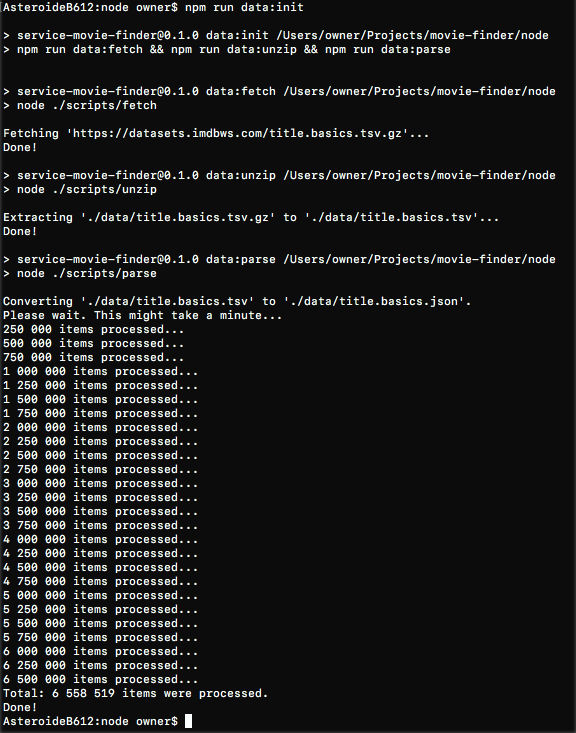

## Endpoints

    GET /movies
    POST /movies

## Dependencies

-   Node
-   Express
-   Prettier config

## Setup Node API

To set up the Node API, please enter the following commands in your terminal from the root of this repository:

    cd node
    npm i

## Dataset

To automatically fetch, extract, and convert to JSON the data set, run this command in `/node`:

    npm run data:init

The output in your terminal should look like this:

You may then start the api.

    npm start

## Setup React client

## Development

    cd node
    npm start

A Node microservice will start listening for requests at `localhost:3000`.

## Assignment

-   [x] Réaliser une application Web (React ou Angular) qui permet de visualiser une liste d’éléments correspondant à des films.

-   [x] Ces éléments seront chargés via Webservices sur un back end (NodeJS ou Java EE).

L’application Web devra :

-   [x] Permettre d’effectuer une recherche sur les éléments de la liste avec les critères suivant (`primaryTitle`, `originalTitle`, `startYear`)

-   [x] Un filtre permet d’organiser la liste par `startYear`.

-   [x] Ajouter un article via une popup en précisant les champs suivants : `primaryTitle`, `originalTitle`, `startYear`.

### Frontend

-   [x] Aucune limite sur les librairies utilisés, préconisé les dernières versions des frameworks / librairies.

-   [x] L’IHM doit être a minima ergonomique.

-   [ ] L’utilisation des stores et/ou de RxJS est possible.

### Backend

Pas d’obligation de persistance de donnée.

NodeJS :

-   [x] A minima ExpressJS

-   [x] Le jeu de données utilisé pour ce test sera le suivant : https://datasets.imdbws.com/title.basics.tsv.gz

-   [x] Ce jeu peut être converti dans le format que vous souhaitez.

-   [ ] Attachés un Readme au projet en précisant les commandes d'exécution des projets front et back.
